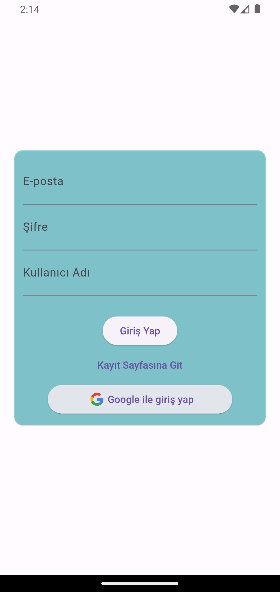
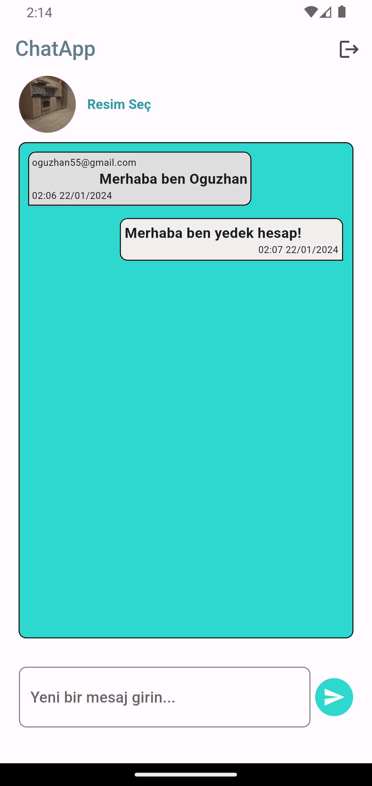

Flutter ile geliştirilmiş backend servis olarak firebase kullanılan, kullanıcı kayıt giriş işlemleri ve mesajlaşma depolaması firebase tarafından kaydedilip kontrol edilen mobil chat uygulamasıdır.
PROJE İÇERİĞİ :
Firebase auth, storage, firestore

